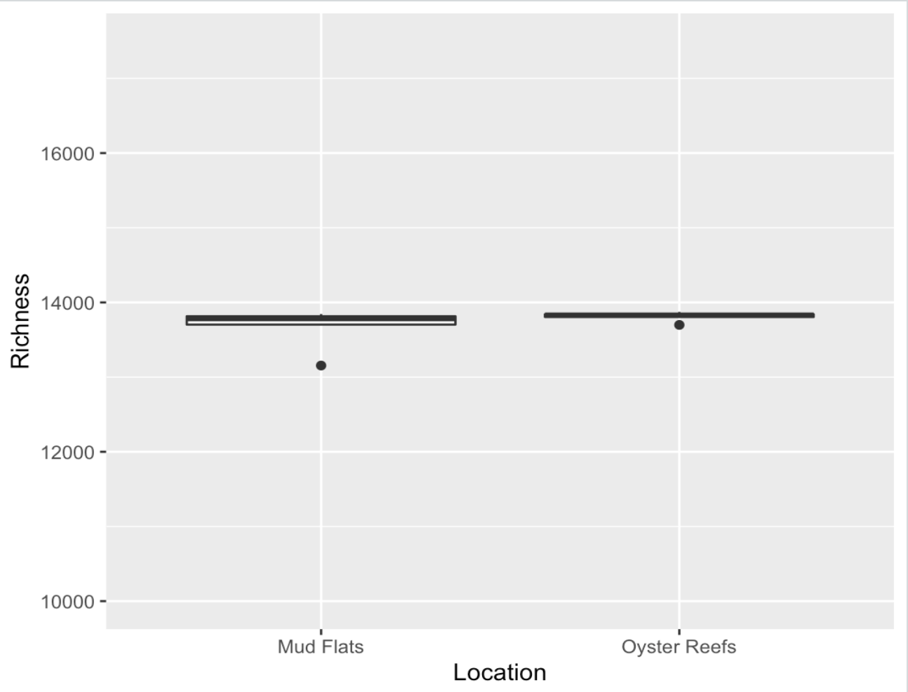

# Microbial_Super_Team

## Background

Oysters are filter feeders, meaning they consume microorganisms by drawing water in over their gills and through beating cilia. The microbes are then digested as food for the oyster. Oysters' method of food consumption, therefore, brings into question the diversity of the microbial community of the environment in which they live. do oysters preferentially filter some microorganisms from their environment and excrete others? Does the presence of oysters decrease the diversity of microbes in the environment? Or do they simply decrease the amount of microbes present in the environment? To answer this, a study was conducted in the Great Bay, NH. Microbial samples were taken from two locations: one from Oyster Beds (where oysters live), and the other from Mud Flats (where no oysters live and is frequently uncovered with water). The 16s rRNA in the samples were then sequenced using the and the prokaryotic species present were identified. Based on research suggesting that the microbial diversity of the intestines of oysters was less than that of its surrounding water (Zheng et al., 2021), we hypothesized that the microbial diversity would be less in the samples from Oyster Beds than the microbial diversity in the samples from the Mud Flats. We also hypothesized that the samples taken from the oyster beds would be highly similar to one another and show a more distinct community signature than the samples taken from the mud flats.

## Methods
### Pipeline using Qiime
Microbial samples were collected from Oyster Beds and Mud Flats in the Great Bay, NH. The collected samples were sequenced with paired end reads. output fastq files of the sequenced reads were imported into Qiime and demultiplexed. Demultiplexted reads were then placed inside Imported_Reads.qza. The quality visualization plot was then made using Imported_Reads.qza as the input and viewed in qiime2view to determine where the reads would be trimmed based on a reduction of quality, which was decidedly around 230 bp for the forward reads and 210 bp for the reverse reads. Imported_Reads.qza was then run through dada2 to denoise the reads, merge the forward and reverse reads, and the the reads were trimmed for quality. The rarification table was then made and it was used that to determine the sampling depth that we would be rarifying at. 2400 was chosen because the sample with the lowest feature count had 2416 and this would ensure that none of the samples were thrown out. The reference reads were then extracted from the silva database that would be used for the taxonomy assignment step. a feature classifier was then trained using the silva reference sequences to classify the microbes in the samples taxonomically. The sequences (rep-seqs.qza) were then run through the trained classifier in order to classify the taxa in the samples taxonomically. This output a taxonomy file (silva_taxonomy.qza). A metadata file was then input and edited in excel so that the samples were sorted by sampling location (either mud flats or oyster reefs). A phylogeny of all the taxa detected in all of the samples was then made and visualized by converting the file from a .qza to a .nwk. This wasn't a very useful visualization though because the file input for the phylogeny was the rep-seqs.qza which was the unclassified sequences, so the tree didn't have any taxonomy information assigned to it. The core diversity metrics were then run using Qiime diversity core-metrics to get an idea of the microbial diversity of the two sampling locations and how they differ. This output several differnt files including the bray-curtis emperor plot which is essentially a PCA clustering the community composition and community abundance of the different samples, color coded by sampling location, as seen below. Taxa bar plots were then created, using the qiime taxa bar plots command, which shows the taxa present in each sample and their relative abundancies (also shown below). The rarefied table, the feature table, the taxonomy classification, and the unrooted tree were then exported so that they could be analyzed in R using the phyloseq package to do statistical analysis and make plots comparing the species diversity and species rihcness by sampling location. 

### Pipeline in R
Once in R, the phyloseq package was installed and the relevant files were merged and converted into a .txt file. This file was then opened in excel and split into two different files, one for taxonomy and the other for the feature table, and then saved as a .csv. Several packages including phyloseq necessary for the statistical analysis and plotting were then loaded including phyloseq, qiime2R, ggplot2, ape, vegan, ggpubr, agricolae, ggsignif, and dplyr. All of the data was then read into R and all columns except for the sample ids were labeled as numeric data so R didn’t confuse them for characters. This was done because there was an error with R not recognizing the data as numeric. The data type for the feature table was then changed to a matrix, the split_tax file was imported into R, the taxonomy file data type was converted to a matrix, the metadata file was imported into R, and the tree file was imported into R. The necessary files were then imported as phyloseq objects so that it could be accessed by the phyloseq package. Next, the head command was performed on each of the objects to ensure that the OTU names were consistent. And the files were checked to make sure they all had the same sample names. All the objects were then combined to create the phyloseq object that was used in the following steps. The next step was to make a dataframe with diversity results and metadata info. There was an error at this step that said input data must be non-negative. Troubleshooting this error was unsuccessful as the non-negative values could not be identified and the task of creating the diversity plots was abandoned. Next a model for the species richness was created and species richness was plotted by location. 

## Findings

The main takeaway of this comparison of the microbial comunity composition and abundance of the mud flats versus the oyster reefs was that the microbial communities were more similar to one another between the samples from the oyster reefs than the samples from the mud flats were to one anothe. This is visualized in figure 3 by the close clustering of the blue dots which represent the samples from the oyster reefs compared to the more spread out red dots from the mud flats. Because a Bray-Curtis plot is essentially a PCA, the closer the dots are in space the more similar they are to one another. The taxa bar plot represents the the richness of the phyla in each sample which is interesting, but isn't very useful for comparing the taxonomic composition of the communities by location as the taxa bar plot is done by sample, not location (Fig. 2). The plot that we tried to make in R comparing the taxonomic diversity by location using an ANOVA would have been really useful for visualizing the differneces, or lackthereof, of taxonomic diversity by location as well as determining if the difference in diversity was statistically significant. But we ran into an error with creating that plot that we couldn't figure out how to get past. The plot showing species richness by sampling location indicates that species richness does not differ by location (Fig. 4).

Figure 1. quality plot showing the base call quality accross the forward and reverse reads. Made from Imported_Reads.qza file using qiime demux summerize command in Qiime2. Output was quality.qzv which was visualized using Qiime2View.

Figure 2. Taxa bar plot showing the relative abundencies of different phyla in the different samples. made from table.qza and silva_taxonomy.qza using qiime taxa barplot command in Qiime2. Output was silva-taxa-bar-plots.qzv which was visualized using Qiime2View.
 

Figure 3. Bray-Curtis Emporer plot clustering the samples by community similarity. Each dot represents an independent sample, and samples are color coded by sampling location, with the samples taken from the oyster reefs shown in blue and the saples taken from the mud flats shown in red. Made from rooted-tree.qza, table.qza, and metadata.tsv in the core diversity metrics step using the qiime diversity core command in Qiime2. Output was all of the core diversity metrics inclusing bray_curtis_emperor.qzv which was then visualized in Qiime2View.

Figure 4. Plot showing species richness by sampling location. made from rich_w_meta whichwas a file created in R containing the species richness data and the metadata. Plot was created using the ggplot package in R.

## References (If Any)
Zheng, Z., Liao, Y., Ye, J., Yang, C., Adzigbli, L., Wang, Q., Du, X., &amp; Deng, Y. (2021, March 23). Microbiota diversity in Pearl Oyster Pinctada fucata martensii intestine and its aquaculture environment. Frontiers. Retrieved May 13, 2022, from https://www.frontiersin.org/articles/10.3389/fmars.2021.655698/full 
