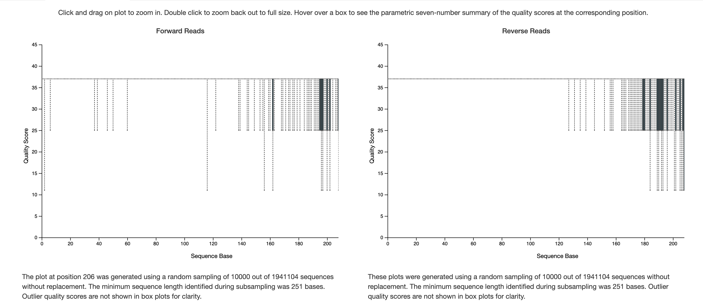
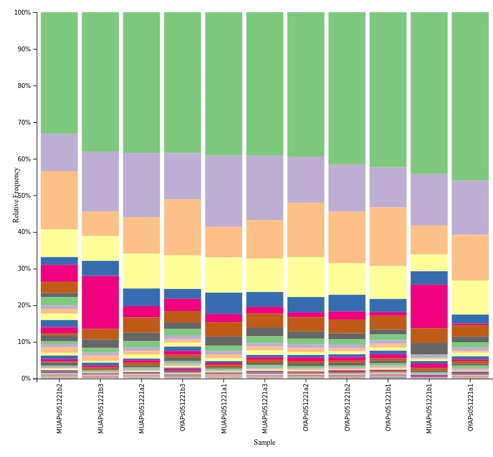
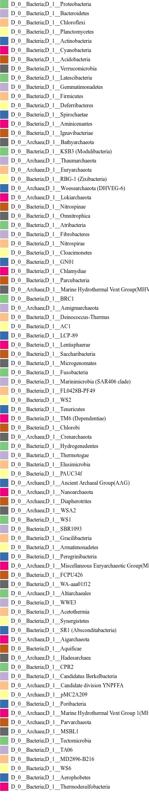
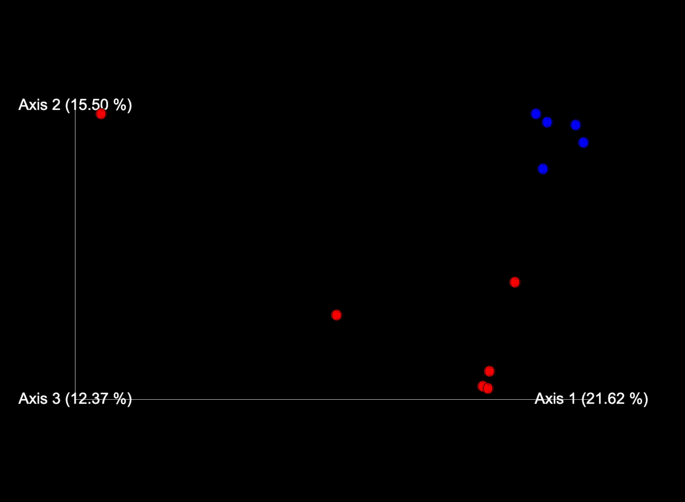
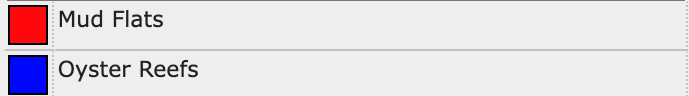

# Microbial_Super_Team

## Background

Oysters are filter feeders, meaning they consume microorganisms by drawing water in over their gills and through beating cilia. The microbes are then digested as food for the oyster. Oysters' method of food consumption, therefore, brings into question the diversity of the microbial community of the environment in which they live. do oysters preferentially filter some microorganisms from their environment and excrete others? Does the presence of oysters decrease the diversity of microbes in the environment? Or do they simply decrease the amount of microbes present in the environment? To answer this, a study was conducted in the Great Bay, NH. Microbial samples were taken from two locations: one from Oyster Beds (where oysters live), and the other from Mud Flats (where no oysters live and is frequently uncovered with water). The 16s rRNA in the samples were then sequenced using the and the prokaryotic species present were identified. Based on research suggesting that the microbial diversity of the intestines of oysters was less than that of its surrounding water (Zheng et al., 2021), we hypothesized that the microbial diversity would be less in the samples from Oyster Beds than the microbial diversity in the samples from the Mud Flats. We also hypothesized that the samples taken from the oyster beds would be highly similar to one another and show a more distinct community signature than the samples taken from the mud flats.

## Methods

Microbial samples were collected from Oyster Beds and Mud Flats in the Great Bay, NH. The collected samples were sequenced with paired end reads. output fastq files of the sequenced reads were imported into Qiime and demultiplexed. Demultiplexted reads were then placed inside Imported_Reads.qza. Imported_Reads.qza was then run through dada2 to denoise the reads and merge the forward and reverse reads. The quality visualization plot was then made and viewed in qiime2view to determine the cutoff for quality. The rarification table was then made and it was used that to determine the sampling depth that we would be rarifying at. 2400 was chosen because the sample with the lowest feature count had 2416 and this would ensure that none of the samples were thrown out. The reference reads were then extracted from the silva database that would be used for the taxonomy assignment step. a feature classifier was then trained using the silva reference sequences to classify the microbes in the samples taxonomically. The sequences (rep-seqs.qza) were then run through the trained classifier in order to classify the taxa in the samples taxonomically. This output a taxonomy file (silva_taxonomy.qza). A metadata file was then input and edited in excel so that the samples were sorted by sampling location (either mud flats or oyster reefs). A phylogeny of all the taxa detected in all of the samples was then made and visualized by converting the file from a .qza to a .nwk. This wasn't a very useful visualization though because the file input for the phylogeny was the rep-seqs.qza which was the unclassified sequences, so the tree didn't have any taxonomy information assigned to it. The core diversity metrics were then run using Qiime diversity core-metrics to get an idea of the microbial diversity of the two sampling locations and how they differ. This output several differnt files including the bray-curtis emperor plot which is essentially a PCA clustering the community composition and community abundance of the different samples, color coded by sampling location, as seen below. Taxa bar plots were then created, using the qiime taxa bar plots command, which shows the taxa present in each sample and their relative abundancies (also shown below). The rarefied table, the feature table, the taxonomy classification, and the unrooted tree were then exported so that they could be analyzed in R using the phyloseq package to do statistical analysis and make plots comparing the species diversity and species rihcness by sampling location. Once in R we first installed the 
(any more?)
An issue that we ran into were identifying the correct pipeline to reach results in vscode using Conda environment and Qiime2. Collectively, it was difficult to input and process that same code across different computers, in which outputed errors and disturbances in the terminal.

## Findings

To add a plot from the 'figs' folder, there needs to be a line in this document that looks like this:

 

## References (If Any)
Zheng, Z., Liao, Y., Ye, J., Yang, C., Adzigbli, L., Wang, Q., Du, X., &amp; Deng, Y. (2021, March 23). Microbiota diversity in Pearl Oyster Pinctada fucata martensii intestine and its aquaculture environment. Frontiers. Retrieved May 13, 2022, from https://www.frontiersin.org/articles/10.3389/fmars.2021.655698/full 
